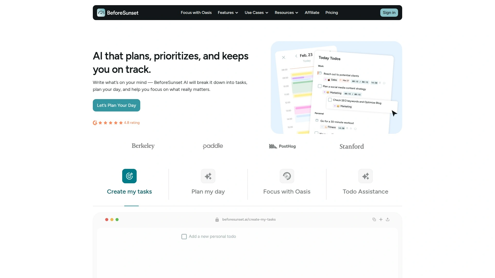
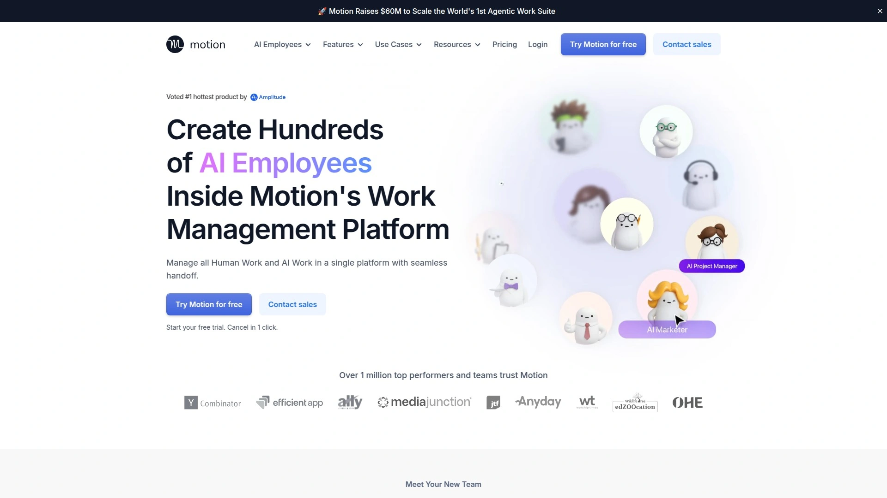
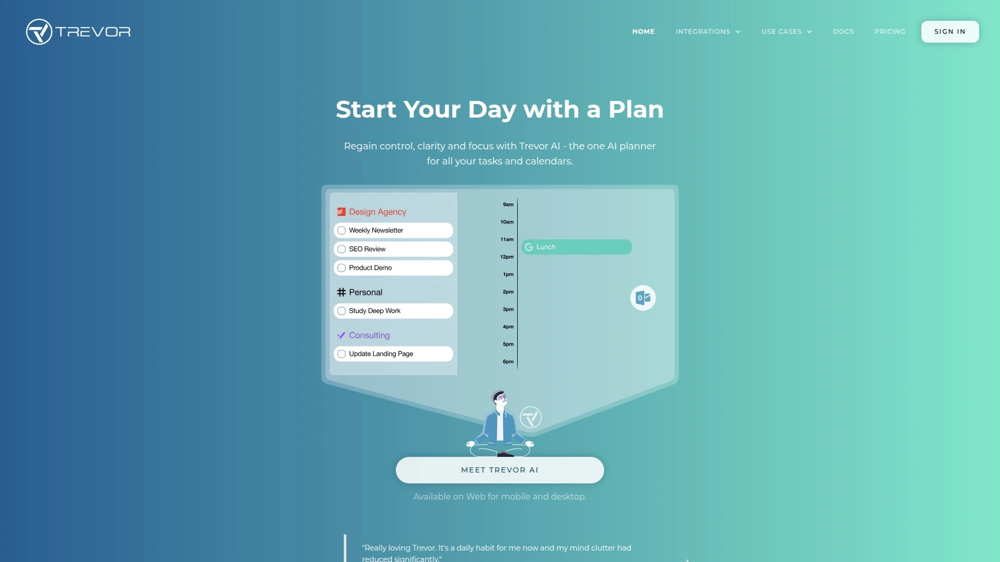
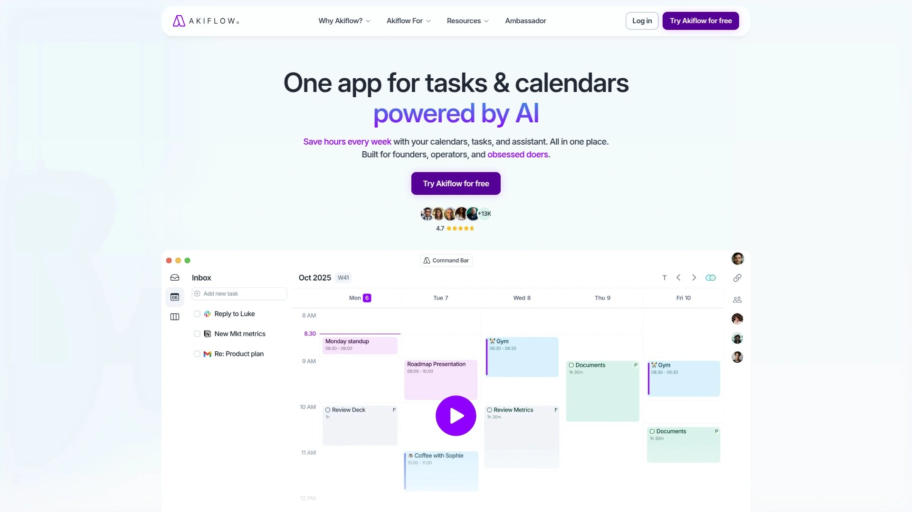
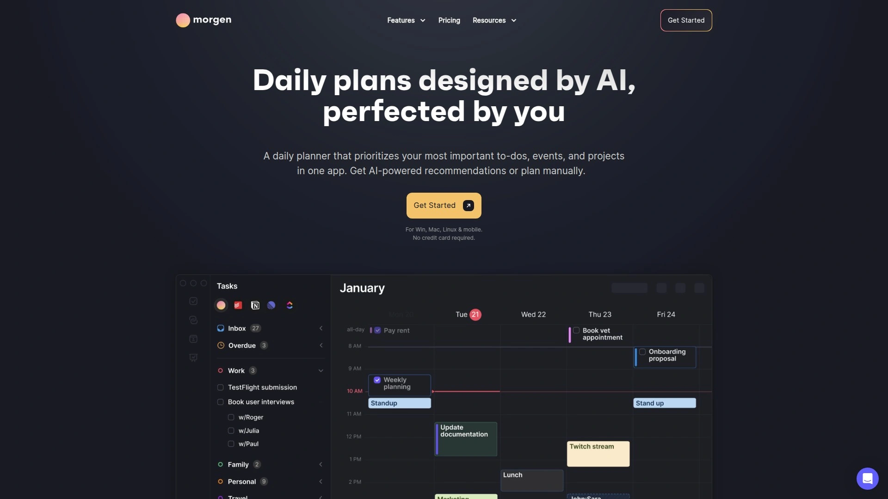
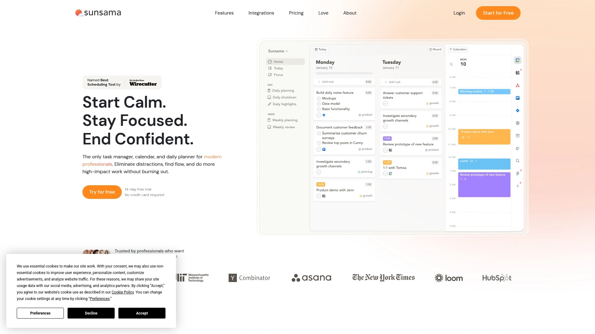
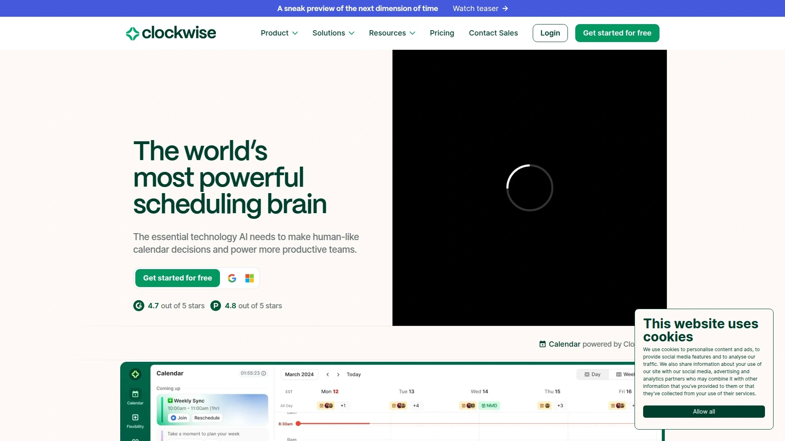
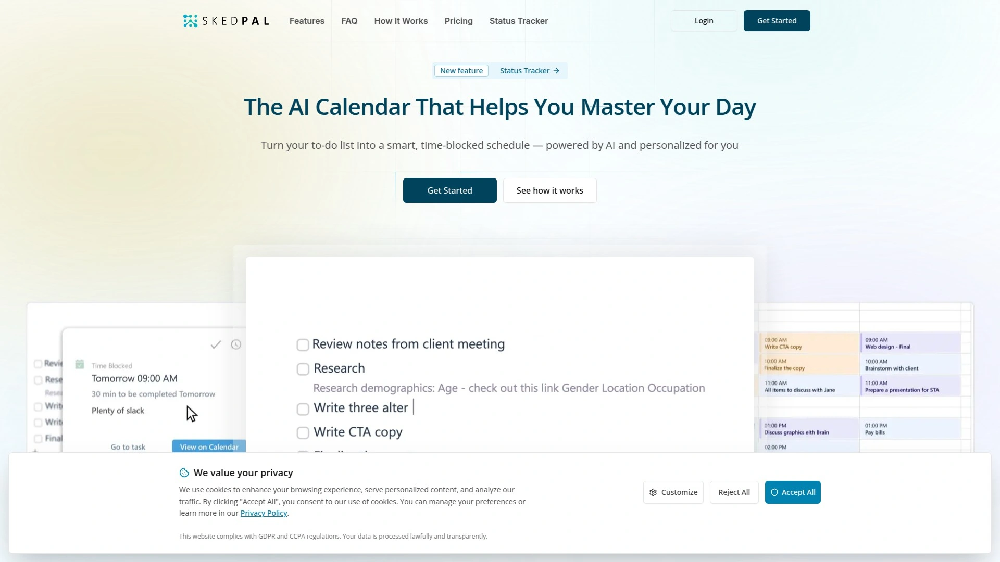
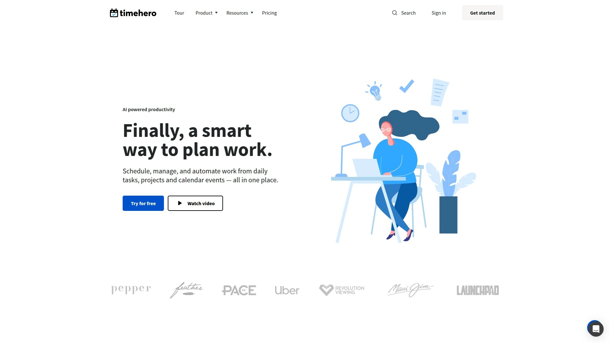

# 2025's Top 10 Best AI Daily Planning Tools

Staring at a to-do list with 47 items wondering what to tackle first? Your calendar looks like Tetris gone wrong—meetings crammed together, zero time for actual work, and that important project still sitting there unscheduled. Manual planning eats 30-45 minutes daily while you shuffle tasks around trying to make everything fit. AI daily planners solve this by automatically scheduling your tasks based on priorities, deadlines, and energy levels, then rescheduling everything when meetings pop up unexpectedly. These tools analyze your calendar patterns, protect focus time, and turn chaotic task lists into realistic daily plans you can actually complete. Whether you're drowning in meetings or just tired of planning the same day three times before lunch, the right AI planner transforms time management from stressful puzzle into automated background process.

## **[BeforeSunset AI](https://www.beforesunset.ai)**

Natural language task creation with AI-powered scheduling across work and personal commitments simultaneously.

You write what's on your mind—"need to finish the sales presentation, call three clients, and squeeze in a workout"—and BeforeSunset AI instantly breaks that stream-of-consciousness into organized, scheduled tasks. The platform understands context, automatically estimating how long each activity takes and placing it in your calendar at optimal times based on your working patterns and existing commitments.

The AI Scheduling feature analyzes task urgency, your available time blocks, and historical completion patterns to arrange everything by priority and efficiency. Hit "Plan My Day" and watch your scattered thoughts become a structured timeline in seconds. This eliminates the mental overhead of figuring out when you'll actually do the 15 things bouncing around your head.

Focus with Oasis creates AI-generated workspaces designed to keep you locked in on whatever you're doing. The feature combines Pomodoro timers, ambient sounds, and distraction-free environments customized to your task type. Working on creative writing gets a different environment than analyzing spreadsheets, helping you enter flow states faster.

The platform includes weekly and monthly views for big-picture planning alongside daily execution. You can schedule recurring tasks that auto-populate, set priorities that influence AI scheduling decisions, and create custom task lists segmented by project or life area. Calendar integrations sync with Google and Outlook, ensuring your AI-planned day incorporates existing meetings without conflicts.

Mobile apps on iOS and Android keep your schedule synchronized across devices. Add a task on your phone during lunch and it instantly appears in your desktop planning view, already scheduled into the appropriate time slot. The pricing sits at $8 monthly ($96 yearly), making it accessible for individuals and small teams wanting AI-powered organization without enterprise budgets.

## **[Motion](https://www.usemotion.com)**

Autonomous AI calendar that automatically reschedules your entire day when priorities shift or meetings appear.

Motion distinguishes itself through fully automatic scheduling that requires minimal manual intervention. You set deadlines and priorities once, then Motion's AI builds your perfect day every morning by analyzing workload, urgency, and calendar availability. The "Happiness Algorithm" reportedly increases productivity by 137% by intelligently balancing task types throughout your day to prevent burnout from too many similar activities clustered together.

When something unexpected disrupts your schedule—a meeting runs long, urgent request arrives, someone cancels—Motion instantly recalculates and reorganizes your entire remaining day. Tasks automatically shift to new optimal time slots without you touching anything. This dynamic rescheduling eliminates the frustration of manually adjusting six different tasks because one meeting moved 30 minutes.

The platform handles four priority levels from ASAP to Low, creating clear task hierarchies that inform scheduling decisions. You can set hard deadlines that absolutely must be met versus soft deadlines with flexibility. Motion monitors task progress and alerts you when assignments risk missing deadlines, helping you course-correct before problems escalate.

Project management features let teams collaborate on shared workflows with automated task assignment and dependency tracking. The AI accounts for everyone's calendars when scheduling collaborative work, finding times that actually work for all participants rather than forcing impossible coordination.

Pricing starts at $19 monthly per user with 7-day free trials. The investment pays off for professionals whose time is valuable enough that saving hours weekly justifies the subscription cost. Integration with Zoom, Google Meet, Microsoft Teams, Gmail, and Outlook ensures Motion fits into existing workflows without requiring platform switches.

## **[Reclaim AI](https://reclaim.ai)**

Flexible time defense creating 40% more productive hours by auto-scheduling focus blocks, habits, and breaks.

Reclaim operates as an intelligent layer atop Google Calendar and Outlook rather than replacing them. The AI identifies gaps in your schedule and automatically protects focus time for deep work before meetings consume everything. You set weekly goals for concentrated work hours, and Reclaim defends those blocks while flexibly adjusting them around immovable commitments.

The Habits feature maintains routines like exercise, meal breaks, or daily planning sessions by finding recurring time slots that work consistently. When conflicts arise—someone schedules a meeting during your usual workout time—Reclaim automatically moves the habit to the next best available slot that day. This flexible rescheduling means routines actually happen rather than getting perpetually skipped.

Tasks auto-schedule directly in your calendar based on deadlines and priority. The system understands which work needs concentrated focus versus quick completion, scheduling accordingly. Smart Meetings coordinate internal team syncs by finding optimal times across multiple calendars, eliminating the typical scheduling negotiation where five people exchange twenty messages trying to find 30 shared minutes.

Buffer Time automatically inserts breaks between back-to-back meetings, preventing the exhausting marathon where you finish one Zoom call and immediately join another with zero breathing room. Travel time gets added for in-person appointments. No-Meeting Days protect entire workdays for deep focus when you absolutely need uninterrupted thinking time.

Pricing starts at $8 monthly per user with a permanently free Lite plan offering basic features. Integration with Asana, Todoist, ClickUp, Jira, Linear, and Google Tasks pulls to-dos from wherever they live into one unified planning system. Slack integration keeps your status updated automatically so teammates know when you're in focus mode.

## **[Trevor AI](https://www.trevorai.com)**

Intelligent time-blocking planner scheduling daily tasks with personal AI models trained on your working style.

Trevor AI learns your patterns over time, building a personalized AI model that understands when you work best on different task types. Morning person who crushes analytical work before 10 AM? Creative work flows better in late afternoon? Trevor's AI recognizes these rhythms and schedules accordingly without you explicitly programming preferences.

The Smart Scheduling Queue prioritizes which tasks to tackle first based on urgency, importance, and your current capacity. Add entire lists to the queue and Trevor generates scheduling suggestions for everything at once, showing you a complete proposed day. You can accept individual suggestions or schedule everything with one click, maintaining control while leveraging AI efficiency.

Time-blocking happens visually in calendar view, letting you see exactly when each task fits around meetings and commitments. The preferred time blocks Trevor suggests reflect not just when time exists, but when you'll realistically complete that specific work type effectively. Writing reports gets scheduled during your high-energy thinking hours, not the 4 PM slump when you're checking email mindlessly.

Trevor integrates with your existing calendars and pulls tasks from other platforms, creating one consolidated planning surface. The platform emphasizes giving you complete control—suggestions are proposals you approve or reject rather than automatic scheduling you can't override. This "human-in-the-loop" approach works well for people who want AI assistance without surrendering autonomy.

Pricing starts at $5 monthly with 7-day free trials for new users. The affordable entry point makes Trevor accessible for individuals, students, and early-career professionals building planning habits without premium tool budgets.

## **[Akiflow](https://akiflow.com)**

Time-blocking consolidator unifying tasks from 3000+ apps into one AI-powered command center.

Akiflow shines for people drowning in tools—email, Slack, Trello, Asana, Gmail, ClickUp all generating tasks scattered across platforms. The platform automatically imports everything into a unified task list, eliminating the mental overhead of checking six different apps to remember what you're supposed to be doing.

The AI-powered daily planner schedules consolidated tasks onto your calendar, showing exactly when you'll complete work from each source. This visibility prevents double-booking or unrealistic expectations about what fits today. You might have three Asana tasks, five emails requiring responses, two Slack follow-ups, and a personal errand—Akiflow schedules all of it realistically based on your available time and meeting commitments.

Command bar functionality and extensive keyboard shortcuts make the interface lightning-fast for power users who hate clicking through menus. You can capture tasks, reschedule items, search your entire workload, and trigger time blocks without touching your mouse. This efficiency compounds when you're processing dozens of daily tasks.

Calendar integration syncs with Google Calendar, Outlook, and others, displaying everything in unified views. Smart reminders notify you about upcoming deadlines, meeting prep time, and tasks approaching their scheduled slots. Real-time syncing across iOS, web, and desktop means your planned day follows you everywhere.

Pricing sits at $9.50 monthly when billed yearly, positioning Akiflow in the mid-range affordability tier. The 7-day free trial lets you test whether consolidating your scattered workload into one planning interface actually saves time worth the subscription cost.

## **[Morgen](https://www.morgen.so)**

Human-in-the-loop AI planner using customizable Frames to template your ideal week repeatedly.

Morgen takes a unique approach: you define Frames representing recurring time patterns like "Deep Work," "Admin Tasks," or "Creative Projects." Each Frame specifies when it occurs, what task categories belong there, and your ideal intensity level. The AI Planner then generates daily schedules that respect your Frame structure, scheduling appropriate tasks into designated periods.

This Frame system acknowledges that not all hours are equal. Your brain might handle strategic thinking brilliantly Tuesday mornings but struggle Friday afternoons. Morgen lets you capture those patterns once, then generates plans honoring them forever after. The AI suggests schedules as proposals you review and approve rather than automatically implementing changes you might not want.

When conflicts arise—urgent requests, meeting invites during planned focus time—AI Planner alerts you and offers one-click plan reprioritization. Previously scheduled incomplete tasks get surfaced so nothing falls through cracks. The system evaluates capacity to highlight unscheduled work at risk of missing deadlines, giving you early warning rather than last-minute surprises.

Task consolidation pulls from Notion, ClickUp, Todoist, Linear, and other platforms into Morgen's unified view. Calendar management handles multiple calendars simultaneously, preventing double-bookings across work and personal commitments. Scheduling links create Calendly-style booking pages checking your real-time availability.

Pricing structure wasn't prominently disclosed but the platform offers free access with optional paid tiers. The AI Planner itself requires paid access to generate automated daily plans, though manual planning remains free.

## **[Sunsama](https://www.sunsama.com)**

Zen-like intentional planner encouraging mindful daily ritual with automatic time tracking and reflection.

Sunsama emphasizes the planning process itself as valuable rather than rushing to automation. Each morning you participate in a guided planning session—reviewing yesterday, setting today's goals, pulling tasks from integrated tools, and timeboxing everything intentionally onto your calendar. This ritualistic approach helps you enter the day with clarity rather than reactively responding to whatever screams loudest.

The platform discourages overcommitment by visualizing how tasks fit your available time. As you add work, Sunsama shows remaining capacity shrinking, naturally limiting you to realistic daily loads. This prevents the common problem of scheduling 12 hours of work into 6 available hours then feeling defeated when you don't finish.

Integration with Asana, Trello, ClickUp, Jira, Gmail, Outlook, Slack, and Teams lets you pull tasks from wherever they originate. You drag items from these sources into Sunsama's daily plan, immediately scheduling when you'll actually complete them. This bridges the gap between backlog-focused project tools and execution-focused daily planning.

Automatic time tracking records how long tasks actually take versus estimates, helping you improve future planning accuracy. Daily shutdown rituals guide you through reviewing accomplishments, noting what's incomplete, and consciously ending your workday. This psychological closure reduces evening work anxiety and helps you detach from unfinished tasks.

Pricing runs $20 monthly with 14-day free trials. The cost reflects Sunsama's positioning as a premium tool for professionals willing to invest in thoughtful work practices rather than pure task velocity.

## **[Clockwise](https://www.getclockwise.com)**

Team-focused AI optimizing everyone's calendars simultaneously to create collective focus time.

Clockwise operates at team level rather than just individual planning. The AI analyzes all team members' calendars and automatically shifts flexible meetings to create longer, uninterrupted focus blocks for everyone. Instead of each person having scattered 30-minute gaps, Clockwise consolidates fragmented time into meaningful 2-4 hour stretches where deep work actually happens.

The Autopilot feature continuously monitors calendars and makes adjustments as things change. Someone cancels a meeting? Clockwise immediately evaluates whether moving other meetings creates better focus time and executes the reorganization automatically. This constant optimization happens silently in the background rather than requiring daily manual attention.

No-Meeting Days become protected team-wide, establishing shared expectations that Wednesdays (or whatever day you designate) are for heads-down work without interruptions. Focus Time holds appear automatically in your calendar, blocking schedules so colleagues know not to book you during prime productivity hours.

Analytics show where team time actually goes—how many hours in meetings versus focus work, meeting distribution across the week, and individual productivity patterns. These insights help teams identify whether meeting culture is consuming too much capacity and make data-driven decisions about calendar policies.

Pricing includes a permanently free individual plan with team plans starting at $6.75 monthly per user. The team-level optimization only activates when enough teammates adopt Clockwise, creating network effects where value increases as more people join.

## **[SkedPal](https://www.skedpal.com)**

Advanced time-blocking with AI auto-rescheduling responding instantly when priorities change.

SkedPal turns static to-do lists into live, adaptive schedules that recalibrate throughout the day. Running late on a task? SkedPal automatically pushes subsequent work to accommodate the delay without derailing everything. Urgent request arrives? Bump the priority and watch your entire schedule reorganize to fit the new deadline while preserving time for other commitments.

The platform uses intelligent auto-scheduling analyzing task urgency, your availability, preferred working style, and constraints like recurring routines. It builds days that respect how you actually work—morning routines, afternoon energy dips, evening family commitments—rather than just filling every available minute with tasks.

Status tracking provides visibility into goal progress with habit-building features for recurring routines you want to establish. The system separates personal and work tasks, scheduling both into balanced daily plans that acknowledge life exists beyond your job. This prevents work from consuming 100% of planned time, leaving personal responsibilities perpetually deferred.

Integration with Asana, Google Calendar, and Zapier lets SkedPal pull tasks from existing systems. Two-way calendar sync ensures changes made in either place reflect everywhere, avoiding the drift that happens when tools fall out of sync and you stop trusting either one.

Pricing starts at $9.95 monthly for the Core plan with Pro features at $14.95 monthly, both billed annually. The 14-day free trial provides substantial testing time to evaluate whether SkedPal's approach matches your planning preferences.

## **[TimeHero](https://www.timehero.com)**

Work planning tool automatically scheduling tasks, projects, and meetings based on workload and availability.

TimeHero focuses on automatic work planning that accounts for your actual capacity rather than wishful thinking. The AI analyzes how long tasks realistically take based on historical data, then schedules them into available time slots while accounting for existing meetings and commitments. This prevents the optimistic planning where everything looks fine until you realize there's 14 hours of work scheduled for an 8-hour day.

Project-level planning breaks large initiatives into tasks with dependencies, automatically scheduling component pieces in the correct sequence. When one task runs long, TimeHero adjusts all dependent work downstream rather than letting the delay cascade silently until deadlines get missed.

The platform handles recurring tasks intelligently, ensuring routine work gets scheduled consistently without manual re-entry every week. Meeting scheduling finds times that work for all required participants by analyzing everyone's calendars simultaneously, eliminating scheduling tennis.

Team collaboration features assign tasks with visibility into everyone's workload. Managers can see whether team members have capacity before assigning additional work, preventing the burnout that happens when people get stacked with requests exceeding available hours.

Pricing details require contacting TimeHero directly for quotes customized to team size and needs. The platform targets teams and organizations rather than individuals, reflecting its emphasis on collaborative work planning rather than personal productivity.

## FAQ

**How do AI planners handle unexpected schedule changes?**

Modern AI planners excel at dynamic rescheduling when disruptions occur. Tools like Motion and Reclaim AI automatically reorganize your entire remaining day within seconds when meetings get added, deadlines change, or tasks run longer than estimated. The AI evaluates all incomplete work, existing commitments, and priorities to generate a new optimal schedule without manual intervention. SkedPal and TimeHero specifically emphasize real-time adaptation, continuously recalibrating plans as your day unfolds rather than requiring you to manually shuffle tasks around. This automatic adjustment eliminates the 15-minute replanning sessions that traditionally followed every schedule disruption.

**Can AI daily planners integrate with my existing calendar and task management tools?**

Yes, integration is a core feature across all major AI planners. BeforeSunset AI, Reclaim AI, Motion, and Akiflow connect with Google Calendar, Outlook, and Apple Calendar to ensure AI-scheduled work incorporates existing meetings without conflicts. For task management, these platforms integrate with Asana, Todoist, ClickUp, Trello, Jira, Linear, and Notion, automatically importing to-dos into unified planning views. Email integration with Gmail and Outlook lets you convert messages into scheduled tasks. Slack and Teams connections capture action items from conversations. This comprehensive integration means you don't abandon existing workflows—the AI planner becomes the central scheduling layer coordinating everything.

**Do I need technical skills to use AI planning tools effectively?**

No technical expertise is required for any mainstream AI planner. Tools like BeforeSunset AI and Trevor AI emphasize natural language input—you literally type what's on your mind and the AI understands context to create scheduled tasks. Setup typically involves connecting your calendar (one-click authorization), optionally linking task management tools, and setting basic preferences like working hours and priorities. The AI handles complexity behind the scenes while presenting simple interfaces for reviewing and approving suggested schedules. Most platforms offer 7-14 day free trials with tutorial walkthroughs, letting you evaluate usability before committing financially.

## Conclusion

Stop wasting 30-45 minutes daily manually arranging tasks only to re-plan everything when reality inevitably deviates from your perfect schedule. AI daily planners transform chaotic to-do lists into executable calendars that automatically adapt to changing priorities, protect focus time from meeting overload, and actually consider your energy levels when scheduling cognitively demanding work. [BeforeSunset AI](https://www.beforesunset.ai) delivers exactly this transformation—natural language task creation, intelligent AI scheduling across work and life, and Focus with Oasis for distraction-free execution, all at $8 monthly making AI-powered planning accessible for individuals and small teams wanting organized days without enterprise software complexity or pricing.
